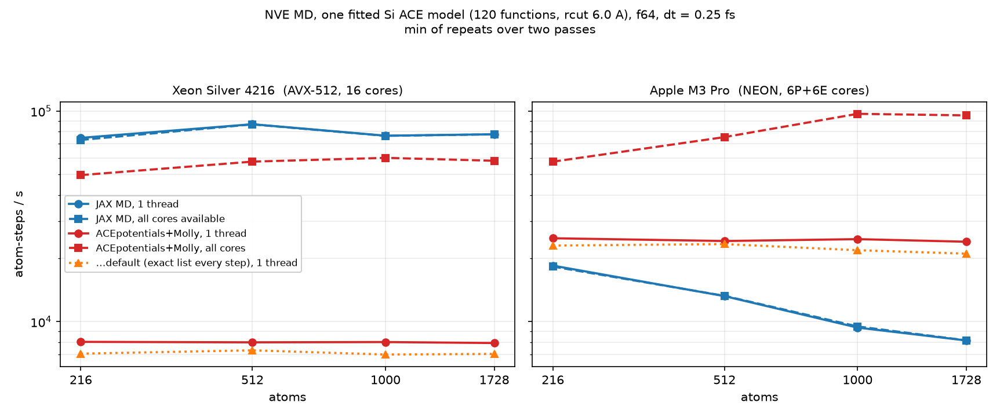

# JAX MD vs ACEpotentials.jl driven by Molly.jl — CPU, same model, same system

First comparison in this project between the JAX port and the Julia original
**as MD engines** rather than as descriptor evaluators. Everything before this
compared single-point evaluation, or JAX against C++ (`pair_style pace`).



## The answer, in one line

**The two engines are within a factor of a few of each other, and *which one
wins reverses between the two CPUs tested.*** On the Xeon (AVX-512) the JAX
path is 9-11x faster than ACEpotentials on one thread and still ~1.4x faster
than ACEpotentials on all sixteen. On the Apple M3 Pro (NEON) ACEpotentials on
**one** thread is 1.3-2.9x faster than the JAX path, and the margin grows with
system size. A single-host answer to "is the JAX port faster" would have been
wrong half the time.

## Headline throughput, atom-steps/s

Julia is quoted in its best configuration (see "The Verlet skin is a trap"
below); JAX is quoted end-to-end, `inner step + rebuild/10`, both printed by
`ace_md.py`. Min over repeats; two full passes.

### moriarty — Xeon Silver 4216, 16 physical cores, AVX-512, f64

| atoms | JAX, 1 core | JAX, 16 cores | Julia, 1 thread | Julia, 16 threads | JAX(1 core) / Julia(1 thr) | JAX(1 core) / Julia(16 thr) |
|---|---|---|---|---|---|---|
| 216  | 7.46e4 | 7.30e4 | 8.02e3 | 4.97e4 | 9.3x | 1.50x |
| 512  | 8.67e4 | 8.65e4 | 7.98e3 | 5.76e4 | 10.9x | 1.50x |
| 1000 | 7.64e4 | 7.63e4 | 8.01e3 | 6.00e4 | 9.5x | 1.27x |
| 1728 | 7.76e4 | 7.76e4 | 7.92e3 | 5.81e4 | 9.8x | 1.34x |

### the Mac — Apple M3 Pro, 6 performance + 6 efficiency cores, NEON, f64

| atoms | JAX, 1 thread | JAX, all cores | Julia, 1 thread | Julia, 12 threads | Julia(1 thr) / JAX |
|---|---|---|---|---|---|
| 216  | 1.85e4 | 1.83e4 | 2.49e4 | 5.75e4 | **1.35x** |
| 512  | 1.32e4 | 1.33e4 | 2.42e4 | 7.53e4 | **1.83x** |
| 1000 | 9.38e3 | 9.50e3 | 2.47e4 | 9.71e4 | **2.63x** |
| 1728 | 8.15e3 | 8.16e3 | 2.40e4 | 9.55e4 | **2.94x** |

Same numbers as ms/step, which is what the raw logs report:

| atoms | Xeon: JAX 1c / Julia t1 / Julia t16 | M3 Pro: JAX / Julia t1 / Julia t12 |
|---|---|---|
| 216  | 2.894 / 26.93 / 4.349 | 11.70 / 8.674 / 3.754 |
| 512  | 5.908 / 64.15 / 8.894 | 38.70 / 21.19 / 6.803 |
| 1000 | 13.083 / 124.93 / 16.670 | 106.63 / 40.54 / 10.30 |
| 1728 | 22.260 / 218.15 / 29.733 | 212.12 / 72.08 / 18.10 |

### Two things the table says that were not expected

1. **The JAX MD path is single-threaded on CPU, on both hosts.** Giving it all
   16 Xeon cores instead of one changed the step time by 0.1-2.3% (2.894 →
   2.960 ms at 216 atoms, 22.260 → 22.276 ms at 1728). On the Mac, forcing
   `--xla_cpu_multi_thread_eigen=false intra_op_parallelism_threads=1` was
   likewise indistinguishable from the default. So "default-threaded JAX" and
   "single-threaded JAX" are the same measurement, and the honest per-core
   comparison is JAX-on-1 against Julia-on-1. The path's own parallelism is the
   `--ranks` mechanism, which its README explicitly disclaims as a CPU scaling
   measurement; it was not used.

2. **JAX degrades superlinearly with system size on Apple Silicon and not on
   the Xeon.** Per-atom step cost, µs:

   | atoms | Xeon | M3 Pro |
   |---|---|---|
   | 216  | 13.4 | 54.2 |
   | 512  | 11.5 | 75.6 |
   | 1000 | 13.1 | 106.6 |
   | 1728 | 12.9 | 122.8 |

   Flat on the Xeon, a 2.3x climb across the series on the M3 Pro. ACEpotentials
   is flat on both (Julia 1-thread per-atom cost varies by 1.3% across the series on
   the Xeon and 3.9% on the M3 Pro). Whatever the JAX kernel is doing badly on
   NEON, it gets worse with size; this is the mechanism behind the widening
   margin in the Mac column, and it is the single largest unexplained result
   here — see "Not obtained".

## Both engines are running the same physics — checked before anything was timed

`dump_initial_state.py` replays `ace_md.py`'s construction exactly (same
`np.random.default_rng(0)`, same call order, nothing between the two draws
touches the RNG), so both engines start from bit-identical positions **and**
velocities. Six legs of ten steps at dt = 0.25 fs, 216 atoms:

| after | JAX MD (`ace_md.py`) PE / eV | ACEpotentials + Molly PE / eV |
|---|---|---|
| 10 steps | -35238.730480 | -35238.730480 |
| 20 steps | -35238.882125 | -35238.882125 |
| 30 steps | -35239.200372 | -35239.200372 |
| 40 steps | -35239.818225 | -35239.818225 |
| 50 steps | -35240.929690 | -35240.929690 |
| 60 steps | -35242.806103 | -35242.806103 |

Final PE -35242.806102678 (JAX) against -35242.806102641 (Julia):
**|Δ| = 3.7e-8 eV after 60 steps**, 1.7e-10 eV/atom. Kinetic energies agree to
the printed 11.7743 eV and both report the same conservation, **+0.2062
meV/atom/ps**. This is sixty velocity-Verlet steps of one trajectory computed
by two independent codebases, not a single-point check. It reproduces on the
Mac to the same digits.

**Model identity.** The Julia side refits `ace1_model(Si, order=3,
totaldegree=10)` with `ACEfit.BLR()` on `Si_tiny` — the fit in
`acejax/julia/export_model.jl` at its defaults, which is the fit behind
`fixtures/si_fitted.npz` (120 basis functions: 110 many-body + 10 pair, rcut
6.0 Å). `check_model_match.py` re-ran that exporter and diffed the fresh npz
against the shipped fixture: **33 of 37 arrays bit-identical**; `Wpair` differs
by 2.4e-10 relative and the two test observables by ~1.2e-10, which is the
BLR solve's own reproducibility; `meta_json` differs (metadata string) and
`A2B` is stored sparse in the fresh export and dense in the fixture, a storage
format, not a model.

## What the Molly integration cost

Short version: **the interface worked first try. The only real work was making
a cached neighbour list *correct*, and that work turned out to be
counterproductive.** No extension, no patch to either package, nothing
upstream.

### What worked immediately — about 15 lines

```julia
sys = Molly.System(atoms=…, atoms_data=…, coords=…, velocities=…,
                   boundary=Molly.CubicBoundary(L*u"Å"),
                   general_inters=(model,),            # <- the ACEPotential
                   neighbor_finder=Molly.NoNeighborFinder(),
                   energy_units=u"eV", force_units=u"eV/Å")
Molly.simulate!(sys, Molly.VelocityVerlet(dt=0.25u"fs", remove_CM_motion=0), n)
```

`model` is what `ACEpotentials.load_model` returns. Molly (`force.jl:198`)
calls `AtomsCalculators.forces(sys, inter; neighbors, step_n, n_threads)`;
`AtomsCalculatorsUtilities`' `SitePotential` assembly accepts and ignores those
keywords, builds its own `PairList` from `sys` (Molly's `System` is an
`AtomsBase.AbstractSystem`), and returns `eV/Å`. Three things had to be right:

1. **Units.** Molly checks energy/mass/force are consistently molar or
   non-molar and that `force_units == energy_units / length_units`. `eV`, `u`,
   `eV/Å`, `Å` passes; Molly's defaults (`kJ/mol`, `g/mol`, `nm`) do not, and
   the failure is a clear `ArgumentError`, not a silent rescale.
2. **Species.** `AtomsBase.species(sys, i)` on a Molly system reads
   `sys.atoms_data[i].element`; `Molly.Atom` carries no atomic number. Without
   `atoms_data=[Molly.AtomData(element="Si"), …]` the ACE side cannot resolve
   the species.
3. **`remove_CM_motion=0`.** Molly's `VelocityVerlet` removes centre-of-mass
   motion every step by default; `ace_md.py` zeroes the CM velocity once at
   setup and never again, so leaving it on would be a different integrator.
   Its cost, measured as a single-variable difference over whole runs at 216
   atoms (`--remove-cm 1` against `--remove-cm 0`, everything else identical):
   **nothing at 1 thread** (27.012 vs 27.021 ms/step) and **6.2% at 16
   threads** (4.582 vs 4.314 ms/step) — an O(N) reduction that costs nothing
   serially but does not thread, so it shows up only once the force loop has
   been made cheap.

   > This replaces an earlier figure of "2.1x" that appeared in a draft of this
   > file. That number came from comparing two runs of *different versions of
   > the benchmark script* that happened to differ in this flag among other
   > things — the same class of error as attributing cost to an isolated stage,
   > and caught the same way, by going back and changing exactly one variable.

### What did not work, and is a finding about the Julia stack

`NeighbourLists.PairList` **is not a Verlet list**. The site assembly reads its
geometry out of the list — `_getR(nlist, idx) = X[j] - X[i] + C'S` — so a
`PairList` handed back unchanged next step **freezes the configuration**. The
first version of this benchmark did exactly that and produced a trajectory
whose potential energy was constant to six decimal places across three legs
while the kinetic energy climbed: an integrator running on forces from a
configuration it had left behind. **Nothing errored.**

Reusing a list means refreshing `nlist.X` every step, with positions
*continuous* with those the shifts `S` were built from — while Molly re-wraps
`sys.coords` into the box every step. The working wrapper (`CachedNLCalculator`
in `md_molly.jl`, ~40 lines) stores the build-time positions and writes back
`xref[i] + minimum_image(x[i] - xref[i])`, tracks the maximum displacement, and
rebuilds on the 10-step cadence or when it exceeds skin/2.

### Molly's own overhead: zero, measured by difference

Mode `bare` is the identical velocity-Verlet update written by hand against the
same `System` and calculator, with `Molly.simulate!` removed. Across the whole
series on both hosts it lands within ±3% of Molly, in both directions and with
no consistent sign:

| atoms | Xeon: Molly / bare, ms | M3 Pro: Molly / bare, ms |
|---|---|---|
| 216  | 39.51 / 39.74 | 12.72 / 12.59 |
| 512  | 93.01 / 92.48 | 30.26 / 29.97 |
| 1000 | 184.29 / 182.65 | 59.69 / 60.51 |
| 1728 | 321.13 / 321.21 | 104.75 / 103.81 |

So the numbers above measure ACEpotentials, not Molly. **Total integration
effort: an afternoon, most of it spent on the neighbour-list trap.**

## The Verlet skin is a trap, and the default is nearly optimal

The obvious "match the JAX cadence" change — a 1.0 Å skin rebuilt every 10
steps — made Julia **29% slower** than just rebuilding the exact list every
step. Sweeping the skin at fixed cadence, 1 thread, ms/step:

| skin (Å) | list cutoff (Å) | 216 atoms | 1728 atoms |
|---|---|---|---|
| 0 (exact, rebuilt every step) | 6.00 | 30.64 | 245.80 |
| 0.25 | 6.25 | 27.05 | 218.98 |
| 0.50 | 6.50 | 27.02 | 218.76 |
| 0.75 | 6.75 | — | 314.79 |
| 1.00 | 7.00 | 39.44 | 325.14 |
| 1.50 | 7.50 | 45.96 | — |

**The cliff is between 6.5 and 6.75 Å, and that is a fact about silicon.** Si
diamond's neighbour shells lie at 2.35, 3.84, 4.50, 5.43 and 5.92 Å, and the
next one is at **6.65 Å**. A skin up to ~0.6 Å therefore adds *no pairs at
all* — its rebuilds amortise for free — while a 1.0 Å skin pulls in a
24-neighbour shell that the site assembly then evaluates in full, because
**`eval_grad_site` applies no distance test**: every pair in the list is
evaluated, and pairs beyond `rcut` contribute exactly zero through the
envelope. Confirmed numerically: skin 0.5 and skin 1.0 give final potential
energies identical to 9 decimal places.

The optimum does not move with system size, and the same ordering holds at 16
threads. Julia's best configuration is therefore a **0.5 Å skin rebuilt every
10 steps**, worth 11-12% over the default at one thread and 1.8-2.0x at
sixteen, and that is what the headline table quotes. The default (exact list, every step) is second best.

**Cost of one `PairList` build, by difference.** Halving the rebuild interval
from 10 steps to 5 — one variable, everything else fixed — costs 0.51-0.86
ms/step at 216 atoms across all four skins, i.e. +0.1 builds/step, so one build
is **5-9 ms at 216 atoms**, 16-29% of a default step. Attributed as a range
from the difference measurement rather than quoted precisely, because the two
available differences (this one, and default-vs-cached) bracket rather than
agree.

**A crossover worth noting:** at 1 thread the exact-list default beats a 1.0 Å
skin (30.64 vs 39.44 ms), but at 16 threads the ordering flips (8.65 vs
5.74 ms). The site loop is threaded; the `PairList` build is not. At 16 threads
the serial build is a much larger share of the step, so amortising it over 10
steps wins even at the price of a bigger list. Amdahl, visible in one table.

## Julia has no faster backend available for this model

Checked so that the Julia side is not reported below its best:

- `ACEpotentials.ETModels.convert2et_full` — the EquivariantTensors-backed
  calculator — **cannot be constructed** for an `ace1_model`:
  `MethodError: no method matching _convert_agnesi(::SplineRnlrzzBasis{…})`.
  It needs a learnable analytic radial basis; `ace1_model` builds a splined one.
- `ACEpotentials.Models.fast_evaluator` is **not defined** in the installed
  version (consistent with `CLAUDE.md`, which records it as broken against the
  current upstream API and its tests skipped).

So the classic `ACEPotential` path is the only one, and it is what was measured.

## Method

**Hosts.** (a) `moriarty`: Intel Xeon Silver 4216 @ 2.10 GHz, 1 socket, 16
physical cores, 32 logical — CPUs 0-15 are the distinct cores, 16-31 their SMT
siblings — 62 GB, idle, nothing on the GPU; Julia 1.11.7, jax 0.11.1. (b) the
Mac: Apple M3 Pro, 6 performance + 6 efficiency cores; Julia 1.11.9, jax 0.10.1.
Both f64.

**Thread counts are set, not defaulted.** On moriarty every run is wrapped in
`taskset -c 0` (one physical core) or `taskset -c 0-15` (all sixteen).
**macOS has no `taskset`**, so on the Mac thread counts are set at the engine
(`julia -t N`, XLA flags) and the OS places them; the M3 Pro is heterogeneous,
so "12 threads" is not 12 equal cores. `BLAS.set_num_threads(1)` in both cases —
the site loop is already threaded and a threaded BLAS beneath it only
oversubscribes (on moriarty `MKL_NUM_THREADS=1` was set in the environment
anyway; on the Mac it defaulted to 6 until pinned).

**Model.** One model both sides, as above. The Julia side uses ACEpotentials at
the **`jax-eval` branch HEAD, not the registered 0.10.2** — deliberately: the
registered version predates commit `266f84eb`, which fixes a ~13x
force-evaluation regression. Benchmarking the registered tag would have been
tuning one side down by an order of magnitude.

**Systems.** `bulk("Si","diamond",a=5.43,cubic=True).repeat(rep)`, rep = 3,4,5,6
→ 216/512/1000/1728 atoms, cubic cells 16.29/21.72/27.15/32.58 Å, perturbed by
0.02 Å Gaussian noise, velocities at 300 K, mean-subtracted.

**Dynamics.** NVE velocity Verlet, dt = 0.25 fs, no thermostat, no CM-motion
removal. Neighbour list rebuilt every 10 steps on the JAX side (one `shard_map`
leg) and per the mode on the Julia side. At 1 fs this potential collapses —
documented in `bench/results.md`; that is the potential, not either engine.

**Timed window, and why it is specified.** `Si_tiny` has no repulsive core, so
even at 0.25 fs the configuration runs downhill: T climbs 276 → 422 K over the
first 60 steps. Later steps cost more than earlier ones, so both engines must
time the *same steps*. `ace_md.py --outer 7 --inner 10` discards leg 0 and times
legs 1-6 — steps 10 to 70. The Julia runner **resets to the initial state for
every repeat**, runs 10 untimed steps and times the next 60: the same window.

**Compilation and warm-up excluded explicitly.** JAX: leg 0 of every run
carries the XLA compile (761 ms/step against ~3 ms for the rest) and
`ace_md.py` already drops it. Julia: one *full-length* warm-up repeat (10 + 60
steps) on a throwaway `System`, discarded. A short warm-up is not enough — with
`-t 16` the first timed repeat was still 20% slower than the third until the
warm-up was made full length, and the whole series was re-run after that was
found.

**Statistics.** Julia: 4 repeats of the same 60-step window per process, `min`.
JAX: 3 invocations per point, each itself a 6-leg mean, `min`. The full series
was run **twice** on each host. Pass-to-pass agreement: on moriarty **0.1-3%**
for almost every point (worst 8.0%, `naive/t16` at 216 atoms). On the Mac
1-5% at 1 thread but **4-45% at 12 threads**, which is laptop thread placement
and thermals; the Mac 12-thread column should be read as indicative, and its
per-pass minima are given in `collected.json` (e.g. 512 atoms: 6.80 and
9.90 ms). The Mac 1-thread column and both JAX columns are solid.

**Attribution is by difference between whole runs, never by isolated stage
timing** — the rule `bench/results.md` reaches in "Isolated stage timings have
now over-counted three times". Every number here is a whole-MD-run measurement;
the Molly overhead, the neighbour-list build and the skin cost are each the
difference between two whole runs differing in exactly one thing.

**What is inside each per-step number.** Julia: the force call — which in the
ACEpotentials assembly also produces the energy and the **virial**, whether
wanted or not — plus the neighbour list and Molly's integration. JAX: the
`shard_map` step (energy + gradient via `value_and_grad`, no virial) plus the
rebuild amortised over its 10-step leg, and the **padded edges** its static
shapes require (1.5x atom slots, 2.0x edge slots at these settings). Neither is
corrected for. Both therefore carry work the other does not, in opposite
directions.

## Where more optimisation went in, stated plainly

**More work went into the Julia side than the JAX side.** The JAX side is
`spike_distmd/ace_md.py` run verbatim, at its hardcoded capacities
(`capacity_mult` 1.5 owned / 2.0 edges) — and `bench/results.md` shows capacity
is worth up to 2.4x for the LAMMPS path, so an equivalent tuning effort on the
JAX side is untried and could move its numbers. On the Julia side I wrote the
whole integration, tried three integration modes, swept the Verlet skin at two
system sizes and two rebuild cadences, checked two alternative backends, and
pinned BLAS. If anything the comparison is therefore generous to Julia; the
Xeon result (JAX ~10x ahead per thread) survives that generosity, and the Mac
result would only widen if the JAX capacities were tuned.

## Not obtained

**Why JAX degrades superlinearly with size on Apple Silicon.** The effect is
large (2.3x per-atom across the series), monotone, reproduces across 6
invocations per point in two passes, and is absent on the Xeon. No attribution
is offered because attributing it would need difference measurements against
varied static capacities, and `ace_md.py`'s are hardcoded — changing them means
modifying the spike, which was out of scope here.

**A second Mac pass of the 12-thread points at usable precision.** Two passes
were run; they disagree by up to 45% at the smaller sizes. Reported as
indicative rather than dropped, with the per-pass minima available.

**Multi-rank JAX on CPU.** `ace_md.py --ranks N` exists and is how the path
would use more cores, but its own README calls CPU ranks "a correctness
harness, **not** a scaling measurement". Not measured rather than measured and
caveated into meaninglessness.
