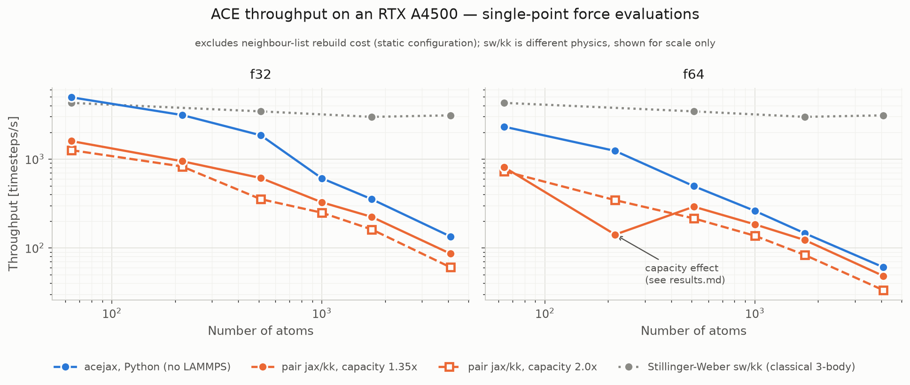

# Throughput results — moriarty, RTX A4500 (compute 8.6), Xeon Silver 4216

Model: fitted `ace1_model(Si, order=3, totaldegree=10)`, n_B = 110, rcut 6.0.
Si diamond supercells, single MPI rank, `gpu/aware off`.

The reference chart in `docs/plans/lammps_jax_benchmark_reference.md` is an
RTX 4070 Laptop at 70 W. Absolute numbers do not transfer between the two;
shape and same-host ratios do.

## Scaling

Throughput in timesteps/s against atom count, log-log, one panel per precision,
in the shape of the upstream chart in
`docs/plans/lammps_jax_benchmark_reference.md` so the two can be read side by
side. Regenerate with `uv run --with matplotlib python make_plot.py`.

Three things the shape shows that the tables do not:

- **The f64 dip at 216 atoms is visible as a V**, not a smooth curve. It is the
  capacity effect below, and it reproduces to under 1%.
- **f32 and f64 share a y-axis**, so the ~2.2x gap between them is a vertical
  offset rather than a number to compare across two scales.
- **Stillinger-Weber is near-flat** while the ACE curves fall roughly as 1/N —
  SW keeps near-constant wall time over this range, so the visible gap widens
  with system size. That is a scale reference, not a like-for-like comparison:
  it is a classical 3-body potential, different physics entirely.

## Method, and what it excludes

`timestep 0.0` freezes the configuration, so `run 100` is 100 repeated
single-point force evaluations at a fixed geometry. This avoids the `Si_tiny`
potential's missing repulsive core, which otherwise lets atoms collapse.

**Two exclusions, stated rather than buried:**

1. With atoms static, `check yes` never triggers a neighbour-list rebuild, so
   these numbers **exclude reneighbouring cost**, which real MD pays
   periodically.
2. XLA compilation happens once at the first force call. At 100 steps its share
   is small but not zero, so small-system numbers are mild underestimates.

## Bundle capacity is a tuning parameter, not a detail

Exported programs have static shapes, so every padded edge is evaluated. At 216
atoms in f64, holding everything else fixed and varying only `max_edges`
(actual edge count 9880):

| max_edges | x actual | ms/step |
|---|---|---|
| 13888 | 1.4 | 7.00 |
| 17360 | 1.8 | 2.97 |
| 20832 | 2.1 | **2.87** |
| 32984 | 3.3 | 3.79 |
| 65968 | 6.7 | 6.92 |

**U-shaped, with a 2.4x penalty at both ends.** Too tight is as bad as too
loose — the small-capacity case is the *slowest* of the five, which is not what
padding cost alone would predict, so some shapes evidently land on a poor kernel
configuration.

The optimum is **per point, not a constant**: a 1.35x margin is near-pessimal at
216 atoms in f64 but the best of the two tried at 512+, while 2.0x fixes 216 and
costs 25-30% at 1728 and 4096. Both series are given below rather than a single
tuned line. Anyone quoting a single throughput number for this pair style should
say what capacity produced it.

## LAMMPS `pair_style jax/kk` (atom-steps/s)

| atoms | f64, 1.35x | f64, 2.0x | f32, 1.35x | f32, 2.0x |
|---|---|---|---|---|
| 64 | 5.17e4 | 4.67e4 | 1.02e5 | 8.06e4 |
| 216 | 3.05e4 | **7.45e4** | 2.04e5 | 1.78e5 |
| 512 | **1.49e5** | 1.10e5 | **3.13e5** | 1.81e5 |
| 1000 | **1.84e5** | 1.37e5 | **3.26e5** | 2.49e5 |
| 1728 | **2.12e5** | 1.44e5 | **3.86e5** | 2.79e5 |
| 4096 | **1.98e5** | 1.37e5 | **3.53e5** | 2.48e5 |

The f64 216-atom point at 1.35x reproduces to under 1% across five runs
(3.05, 3.05, 3.09, 3.06, 3.07e4), so it is a systematic shape effect, not noise.
The same margin is fine for f32 at that size, consistent with a tiling effect
that depends on element width.

## acejax in Python, same GPU

Forces via `jax.grad`, `min` of 10 repeats, compilation excluded.

| atoms | edges | f64 ms/step | f64 atom-steps/s | f32 ms/step | f32 atom-steps/s |
|---|---|---|---|---|---|
| 64 | 2852 | 0.433 | 1.48e5 | 0.202 | 3.17e5 |
| 216 | 9582 | 0.810 | 2.67e5 | 0.320 | 6.74e5 |
| 512 | 22796 | 2.019 | 2.54e5 | 0.541 | 9.46e5 |
| 1000 | 44548 | 3.832 | 2.61e5 | 1.648 | 6.07e5 |
| 1728 | 76920 | 6.839 | 2.53e5 | 2.830 | 6.11e5 |
| 4096 | 182384 | 16.502 | 2.48e5 | 7.433 | 5.51e5 |

f64 plateaus near **2.5e5 atom-steps/s**, f32 near **5.5-9.5e5**.

**f64 costs only ~2.2x f32** (16.50 vs 7.43 ms at 4096), corroborating the
earlier 3-5.4x measurement on different hardware: the descriptor is
memory-bound, so the 1/32 FP64 arithmetic rate is not what governs. f64 is not
the afterthought here that it is for cheaper potentials.

## Plugin overhead

Best-case LAMMPS against acejax-in-Python at the same size and precision:

| atoms | f64 LAMMPS / acejax | f32 LAMMPS / acejax |
|---|---|---|
| 512 | 1.49e5 / 2.54e5 = 0.59 | 3.13e5 / 9.46e5 = 0.33 |
| 1728 | 2.12e5 / 2.53e5 = 0.84 | 3.86e5 / 6.11e5 = 0.63 |
| 4096 | 1.98e5 / 2.48e5 = 0.80 | 3.53e5 / 5.51e5 = 0.64 |

So the plugin path retains roughly **80% of raw model throughput in f64** and
**~65% in f32** at 1728+ atoms, the gap being LAMMPS's own neighbour list,
communication and integration. The f32 gap is larger because the model cost it
is being compared against is smaller, so the fixed overhead weighs more.

## Scale anchor: Stillinger-Weber (different physics)

`pair_style sw/kk`, same Si structure. **This is a classical 3-body empirical
potential, not an ML potential** — included to show where an ACE model sits on
the same host, not as a like-for-like comparison.

| atoms | sw atom-steps/s | vs jax f64 best |
|---|---|---|
| 64 | 2.74e5 | 5x |
| 512 | 1.76e6 | 12x |
| 1728 | 5.15e6 | 24x |
| 4096 | 1.27e7 | 64x |

SW keeps near-constant wall time as the system grows over this range (0.023 to
0.032 s for 100 steps), so its throughput scales almost linearly with atom count
while the ACE model is already GPU-saturated by ~500 atoms.

## Not obtained

**`pair_style pace` comparator.** An ACEpotentials v0.6.12 fit of the same data
exports a `.yace` cleanly and has a matching basis size (110 both versions), but
it will not load: upstream ICAMS libpace rejects it (`bad conversion`, it wants
`ChebPow`/`radcoefficients` rather than v0.6's `ACE.jl` spline nodal values), and
the `wcwitt` fork, which does carry `acejl_radial.cpp`, gets further and fails
with `Exception: map::at`. See `docs/findings/FINDINGS_benchmark.md`.

No substitute potential is presented in its place: a different-complexity ACE
model timed under `pace` would not be the comparison this section is missing.
