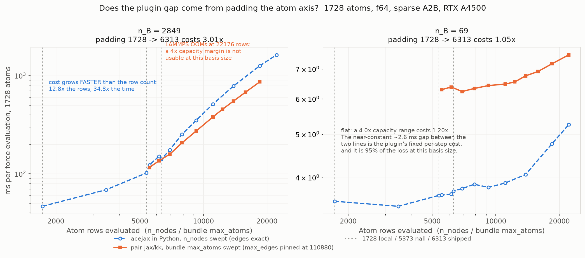

# Throughput results — moriarty, RTX A4500 (compute 8.6), Xeon Silver 4216

Model: fitted `ace1_model(Si, order=3, totaldegree=10)`, n_B = 110, rcut 6.0.
Si diamond supercells, single MPI rank, `gpu/aware off`.

The reference chart in `docs/plans/lammps_jax_benchmark_reference.md` is an
RTX 4070 Laptop at 70 W. Absolute numbers do not transfer between the two;
shape and same-host ratios do.

> **Read the CORRECTION section at the end before using anything below it.**
> The scaling series was built at an unrealistic model shape (high lmax, low
> correlation order). Two conclusions below — "angular is 51.7% of runtime" and
> "the pace/acejax ratio narrows monotonically" — are artefacts of that choice
> and are superseded there. The absolute throughputs stand, but they are the
> throughputs of a 110-function model and **none of them are what
> `scaling.png` plots**; the figure is built entirely from the realistic-shape
> numbers in the CORRECTION section. Two sections below are marked SUPERSEDED
> for that reason.

## Scaling


Throughput in timesteps/s against atom count, log-log, one panel per basis
size, at the realistic shape of the CORRECTION section (n_B = 69, 710, 2849).
Regenerate with `uv run --with matplotlib python make_plot.py`.

**Solid lines are LAMMPS pair styles; dashed lines are acejax called directly
from Python**, which is *not* a pair style: it carries no neighbour list, no
communication, no integration, and no static-shape padding. Same hue = same
implementation, so within a colour the solid/dashed gap is the cost of the
plugin path, and between colours it is the cost of the implementation.

Four things the shape shows that the tables do not:

- **The f64 dip at 216 atoms is a V in the LAMMPS lines and absent from the
  Python ones.** In `pair jax/kk` f64, 216 atoms is *slower* than 64 at
  n_B = 69 and at n_B = 710; in Python, 216 atoms is faster than 64 at all
  three basis sizes. So the dip belongs to the plugin path — bundle capacity
  and kernel shape — not to the model.
- **The plugin gap narrows with system size rather than sitting at a constant
  offset.** The shaded f64 band is at its widest at the left-hand end
  (64-216 atoms) of every panel and at its narrowest at 1728. Its *cause* is not
  the same in every panel — see "Padding is the cause at one end of the plot and
  not the other".
- **The f32 pair narrows the same way**, so this is not a precision effect.
- **At n_B = 2849 the dashed blue line crosses above the green one**: the model
  in Python is slightly faster in f64 than `pair pace/kk` at a matched basis
  size. That crossing is not like-for-like (see below) but it locates the
  remaining gap in the plugin path rather than in the kernel.

## Method, and what it excludes

`timestep 0.0` freezes the configuration, so `run 100` is 100 repeated
single-point force evaluations at a fixed geometry. This avoids the `Si_tiny`
potential's missing repulsive core, which otherwise lets atoms collapse.

**Two exclusions, stated rather than buried:**

1. With atoms static, `check yes` never triggers a neighbour-list rebuild, so
   these numbers **exclude reneighbouring cost**, which real MD pays
   periodically.
2. XLA compilation happens once at the first force call. At 100 steps its share
   is small but not zero, so small-system numbers are mild underestimates.

## Bundle capacity is a tuning parameter, not a detail

Exported programs have static shapes, so every padded edge is evaluated. At 216
atoms in f64, holding everything else fixed and varying only `max_edges`
(actual edge count 9880):

| max_edges | x actual | ms/step |
|---|---|---|
| 13888 | 1.4 | 7.00 |
| 17360 | 1.8 | 2.97 |
| 20832 | 2.1 | **2.87** |
| 32984 | 3.3 | 3.79 |
| 65968 | 6.7 | 6.92 |

**U-shaped, with a 2.4x penalty at both ends.** Too tight is as bad as too
loose — the small-capacity case is the *slowest* of the five, which is not what
padding cost alone would predict, so some shapes evidently land on a poor kernel
configuration.

The optimum is **per point, not a constant**: a 1.35x margin is near-pessimal at
216 atoms in f64 but the best of the two tried at 512+, while 2.0x fixes 216 and
costs 25-30% at 1728 and 4096. Both series are given below rather than a single
tuned line. Anyone quoting a single throughput number for this pair style should
say what capacity produced it.

## LAMMPS `pair_style jax/kk` (atom-steps/s)

| atoms | f64, 1.35x | f64, 2.0x | f32, 1.35x | f32, 2.0x |
|---|---|---|---|---|
| 64 | 5.17e4 | 4.67e4 | 1.02e5 | 8.06e4 |
| 216 | 3.05e4 | **7.45e4** | 2.04e5 | 1.78e5 |
| 512 | **1.49e5** | 1.10e5 | **3.13e5** | 1.81e5 |
| 1000 | **1.84e5** | 1.37e5 | **3.26e5** | 2.49e5 |
| 1728 | **2.12e5** | 1.44e5 | **3.86e5** | 2.79e5 |
| 4096 | **1.98e5** | 1.37e5 | **3.53e5** | 2.48e5 |

The f64 216-atom point at 1.35x reproduces to under 1% across five runs
(3.05, 3.05, 3.09, 3.06, 3.07e4), so it is a systematic shape effect, not noise.
The same margin is fine for f32 at that size, consistent with a tiling effect
that depends on element width.

## acejax in Python, same GPU (n_B = 110 — SUPERSEDED)

> **These numbers are for the superseded 110-function model** (order 3,
> lmax 4) and correspond to no series in `scaling.png`. The Python series at
> the current shapes is measured further down, under "acejax in Python at the
> realistic shapes". Do not mix the two.

Forces via `jax.grad`, `min` of 10 repeats, compilation excluded.

| atoms | edges | f64 ms/step | f64 atom-steps/s | f32 ms/step | f32 atom-steps/s |
|---|---|---|---|---|---|
| 64 | 2852 | 0.433 | 1.48e5 | 0.202 | 3.17e5 |
| 216 | 9582 | 0.810 | 2.67e5 | 0.320 | 6.74e5 |
| 512 | 22796 | 2.019 | 2.54e5 | 0.541 | 9.46e5 |
| 1000 | 44548 | 3.832 | 2.61e5 | 1.648 | 6.07e5 |
| 1728 | 76920 | 6.839 | 2.53e5 | 2.830 | 6.11e5 |
| 4096 | 182384 | 16.502 | 2.48e5 | 7.433 | 5.51e5 |

f64 plateaus near **2.5e5 atom-steps/s**, f32 near **5.5-9.5e5**.

**f64 costs only ~2.2x f32** (16.50 vs 7.43 ms at 4096), corroborating the
earlier 3-5.4x measurement on different hardware: the descriptor is
memory-bound, so the 1/32 FP64 arithmetic rate is not what governs. f64 is not
the afterthought here that it is for cheaper potentials.

## Plugin overhead (n_B = 110 — SUPERSEDED)

> **Superseded**, for the same reason: both sides of these ratios are the
> 110-function model. The realistic-shape version is "The plugin gap across
> sizes" below, and it is a good deal larger than the ~80% quoted here.

Best-case LAMMPS against acejax-in-Python at the same size and precision:

| atoms | f64 LAMMPS / acejax | f32 LAMMPS / acejax |
|---|---|---|
| 512 | 1.49e5 / 2.54e5 = 0.59 | 3.13e5 / 9.46e5 = 0.33 |
| 1728 | 2.12e5 / 2.53e5 = 0.84 | 3.86e5 / 6.11e5 = 0.63 |
| 4096 | 1.98e5 / 2.48e5 = 0.80 | 3.53e5 / 5.51e5 = 0.64 |

So the plugin path retains roughly **80% of raw model throughput in f64** and
**~65% in f32** at 1728+ atoms, the gap being LAMMPS's own neighbour list,
communication and integration. The f32 gap is larger because the model cost it
is being compared against is smaller, so the fixed overhead weighs more.

## Scale anchor: Stillinger-Weber (different physics)

`pair_style sw/kk`, same Si structure. **This is a classical 3-body empirical
potential, not an ML potential** — included to show where an ACE model sits on
the same host, not as a like-for-like comparison.

| atoms | sw atom-steps/s | vs jax f64 best |
|---|---|---|
| 64 | 2.74e5 | 5x |
| 512 | 1.76e6 | 12x |
| 1728 | 5.15e6 | 24x |
| 4096 | 1.27e7 | 64x |

SW keeps near-constant wall time as the system grows over this range (0.023 to
0.032 s for 100 steps), so its throughput scales almost linearly with atom count
while the ACE model is already GPU-saturated by ~500 atoms.

## Comparison with `pair_style pace` (ML-PACE), at matched basis size

**This is a cost comparison at matched basis size, not a comparison of two
fits.** `pace/kk` evaluates every basis function regardless of coefficient
values, so a basis of the right *structure* is all that is needed; the pace
potentials here carry random coefficients. That is safe because `timestep 0.0`
means atoms never move, so a physically meaningless potential cannot
destabilise anything. Neither side's energies are meaningful and none are
quoted.

Built with `pyace` (`python-ace` 0.2.8, cp39 wheels only). Note
`BBasisConfiguration.save()` writes the B-basis; `pair_style pace` reads the
C-tilde basis, so the config must go through
`ACEBBasisSet(bc).to_ACECTildeBasisSet()`, and that writes the `.ace` *text*
format — giving it a `.yace` extension makes yaml-cpp reject it.

### What was matched

| | acejax | pace | |
|---|---|---|---|
| **small** basis functions | 110 | **99** | 10% low |
| **large** basis functions | 211 | **211** | exact |
| correlation order | 3 | 3 | matched |
| lmax (small) | 4 | 4 | matched |
| lmax (large) | 6 | 6 | matched |
| cutoff | 6.0 Å | 6.0 Å | matched |
| elements | 1 (Si) | 1 (Si) | matched |

Same Si diamond supercells for both, so neighbour counts match too. pace is
double precision; our f64 column is the like-for-like comparison and f32 is an
option pace does not offer.

### Throughput, atom-steps/s

| atoms | 110: jax f64 | jax f32 | pace (99) | 211: jax f64 | jax f32 | pace (211) |
|---|---|---|---|---|---|---|
| 64 | 5.34e4 | 1.02e5 | 1.77e5 | 2.55e4 | 7.21e4 | 1.36e5 |
| 216 | 3.03e4 | 2.00e5 | 4.61e5 | 1.95e4 | 1.09e5 | 2.55e5 |
| 512 | 1.50e5 | 3.05e5 | 7.18e5 | 6.76e4 | 1.82e5 | 3.42e5 |
| 1000 | 1.85e5 | 3.29e5 | 8.85e5 | 7.57e4 | 1.83e5 | 3.77e5 |
| 1728 | 2.14e5 | 3.89e5 | 1.08e6 | 8.45e4 | 2.06e5 | 3.94e5 |
| 4096 | 1.98e5 | 3.51e5 | 1.14e6 | 9.60e4 | 1.62e5 | 4.01e5 |

### The ratio is size-dependent, and it narrows

At 4096 atoms, where both are saturated:

| | 110 vs 99 | 211 vs 211 |
|---|---|---|
| pace / jax f64 | **5.8x** | **4.2x** |
| pace / jax f32 | 3.2x | 2.5x |

**pace's advantage shrinks as the basis grows.** Doubling the basis costs pace
2.84x (1.14e6 -> 4.01e5) but costs acejax only 2.06x in f64 (1.98e5 -> 9.60e4)
and 2.16x in f32. So pace degrades super-linearly in basis size over this range
while acejax is close to linear.

A plausible reading is that the small case is dominated by fixed overheads and
neighbour handling, where a mature C++/Kokkos kernel wins comfortably, while the
tensor contraction — which grows with the basis — is where the JAX
implementation is relatively stronger. That is a hypothesis consistent with two
points, not an established scaling law: **both models here are small** (110 and
211 functions), and production ACE potentials are often several hundred to a
couple of thousand. Whether the trend continues, flattens or reverses at that
scale is untested.

## Third size, and a large-basis finding that changes the reading

A third matched pair at production-ish scale: **ours 1429 functions vs pace
1551** (8.5% apart), order 3 and lmax 10 on both sides, rcut 6.0. This is the
closest matched pair available — pace's function count moves in coarse jumps, so
1809-vs-1725 would have matched the count to 4.9% but with lmax 12 against 5,
and shape matters more than count. ~2000 with both shapes matched was not
reachable; 1429/1551 is the documented ceiling.

The 1429 model uses **random, unfitted weights** (`ACE_NOFIT=1`). Coefficients do
not affect cost, and a fit of 1429 functions to Si_tiny would be badly
underdetermined. Note `ace1_model` initialises `WB` to *zero*, which would let
XLA fold the readout away and eliminate the descriptor entirely, so the exporter
randomises explicitly.

### The dense `A2B` contraction dominates at large basis

`A2B` is extremely sparse — usually exactly one nonzero per column. At 1429
functions it is 1429 x 11474 with 11474 nonzeros: **0.070% occupied, 131 MB
dense in f64**. Per-stage timing at 216 atoms, f64, on the GPU:

| stage | dense `A2B` | sparse `A2B` |
|---|---|---|
| A2B contraction | **19.658 ms (99.9%)** | 0.10 ms |
| everything else | ~0.78 ms | ~0.69 ms |
| `site_basis` total | 19.684 ms | 0.80 ms |

Replacing the matmul with a gather and segment-sum (one nonzero per column makes
this straightforward) gives, at 1728 atoms:

| | dense | sparse | speedup |
|---|---|---|---|
| f64 | 2672 atom-steps/s | 21550 | **8.1x** |
| f32 | 27960 | 35280 | 1.26x |

The sparse path is exact, not an approximation — it agrees with the dense one to
0.000e+00 (`tests/test_efv.py::test_sparse_a2b_matches_dense`). It is off by
default because dense is faster at small basis; pass `a2b_sparse=True` to
`load()`.

**Any large-basis number taken with the dense contraction measures our
implementation, not the architecture.** The figures below use the sparse path
for the 1429 point and dense for 110 and 211, where it is the faster of the two.

### The three-point trend

pace / acejax throughput at 1728 atoms, f64 (like-for-like; pace is
double-precision):

| basis (ours vs pace) | pace / jax f64 |
|---|---|
| 110 vs 99 | **5.8x** |
| 211 vs 211 | **4.2x** |
| 1429 vs 1551 | **2.7x** |

**The narrowing holds across all three points and continues.** With the dense
contraction the third point would have read 21.6x and inverted the trend
entirely — which is why measuring both mattered.

## Where the remaining gap is: per-stage breakdown

Stages timed in isolation, 1728 atoms, f64, GPU, n_B = 110:

| stage | ms | share of `site_basis` |
|---|---|---|
| **angular (Ylm)** | 1.135 | **51.7%** |
| radial | 0.454 | 20.7% |
| A2B contraction | 0.359 | 16.4% |
| edge_A product | 0.157 | 7.2% |
| A pooling | 0.139 | 6.3% |
| AA products | 0.083 | 3.8% |
| readout | 0.062 | 2.8% |
| sum of stages | 2.389 | 108.8% |
| `site_basis` whole | 2.196 | |

**Method caveat, and it is a real limit.** Timing stages in isolation *over*
counts, because XLA fuses them in the full computation and avoids materialising
intermediates. At n_B = 110 and 1728 atoms the sum is 8.8% over the whole, which
is tolerable. At n_B = 211 it is 105% over, and at 216 atoms it is 55-176% over,
because the individual kernels are too small for the isolated timing to mean
anything. Only the 110-at-1728 column above is quoted for that reason; the
others are recorded in the commit history but not presented as attributions.

So on the one decomposition that is trustworthy:

- **The spherical harmonics are the single largest stage at ~52%.** That is our
  pure-JAX recursion; pace uses hand-optimised C++. This is a larger lever at
  small basis than `A2B`, and it is the concrete place to look next.
- `AA` products are only 3.8%, so the recursive-evaluator hypothesis
  (`ace_recursive.cpp` sharing subproducts) cannot account for much at this
  basis size. It may matter more at large basis, untested.
- **Edge padding**: at the 1.35x capacity margin used, roughly 26% of evaluated
  edges are padding, so this is a ~1.3x effect on the edge-wise stages
  (radial, angular, edge_A) — about 80% of the work at n_B = 110. Real, but not
  the dominant term.
- **Precision is neutral**, as expected: the f64 column is compared against
  pace's double precision throughout.

**Residual.** Padding (~1.3x on edge-wise stages) does not close a 5.8x gap, and
the harmonics being half our time points at implementation quality rather than
architecture. A substantial fraction of the small-basis gap remains
unattributed. That is the honest state: the measurement says where to look
next — the harmonics — not what the answer is.

# CORRECTION: the series above used an unrealistic model shape

Everything above reached its basis size via **high lmax at low correlation
order** — the 1429-function model is lmax 10, order 3. Real ACE potentials do
not get there that way: they use **lmax 3-6 with correlation order 4-5**. The
exemplar shipped with LAMMPS, `Cu-PBE-core-rep.ace`, is rank 6 / lmax 6 / 742
functions — high body order, moderate lmax. Ours was the opposite shape.

**This invalidated the headline per-stage result.** lmax 10 gives 121 Ylm
channels against 36 at lmax 5, so of course the angular stage dominated — we
made it dominate. The series was rebuilt at **order 4, lmax 5** throughout, with
only the size varying.

## Rebuilt series: order 4, lmax 4-5, rcut 6.0, Si

One detail worth correcting in the sentence above: the rebuilt series is order 4
throughout, but the *small* model is lmax 4, not 5 — `fixtures/si_s69.npz`
carries `lmax: 4`, while `si_m710.npz` and `si_l2849.npz` carry `lmax: 5`. It is
labelled "order 4, lmax 4-5" in `scaling.png` for that reason.

| | acejax | pace | gap | AA terms by rank |
|---|---|---|---|---|
| small | 69 | 78 | 13% | 8 / 39 / 37 / 21 |
| mid | 710 | 693 | 2.4% | 14 / 270 / 1191 / 1481 |
| large | **2849** | **2874** | **0.9%** | 18 / 672 / 7134 / 16292 |

Both sides now match on shape as well as count. The large point is genuinely
production-scale — bigger than the 742-function Cu exemplar. Construction was
fast (0.1-0.5 s); `_auto_nnllmm_spec` was not the bottleneck its comment warns
about at these sizes.

## The per-stage picture changes completely

Same measurement, GPU, 1728 atoms, f64, sparse `A2B`:

| stage | lmax 10 / order 3 (n_B=1429) | **lmax 5 / order 4 (n_B=2849)** |
|---|---|---|
| angular (Ylm) | **51.7%** | **18.9%** |
| AA products † | **3.8%** | ~~37.6%~~ **18.3%** |
| radial | 20.7% | 28.0% |
| A2B contraction | 16.4% | 54.1% |

† **The 37.6% was an over-count; the measured figure is 18.3%.** See
"Isolated stage timings have now over-counted three times" below. Every other
number in this table is an isolated-stage timing and carries the same bias; only
the `AA` row has been remeasured.

**The 51.7% angular figure was a property of the model we built, not of ACE.**
At a realistic shape the harmonics are ~19%.

**And the recursive-evaluator hypothesis is back, though weaker than this table
first suggested.** It was dismissed on "AA is 3.8%, so it cannot explain much" —
but that was measured on a shape with almost no high-rank terms. At order 4 the
rank-3 and rank-4 blocks hold 7134 and 16292 terms and `ace_recursive.cpp`
exists precisely to share subproducts across those. At the corrected 18.3%, `AA`
is still the second-largest stage and still worth attacking; a perfect recursive
evaluator would be bounded by that 18.3%, not by 38%. The original dismissal was
conditioned on our model choice and should not have been generalised — but nor
should the 38% that replaced it.

`A2B` remains the single largest stage even sparse. Dense is not an option at
this size at all: 2849 x 24116 is 550 MB in f64 and takes **679 ms/step**
against 6 ms sparse.

## Throughput, realistic shape (atom-steps/s at 1728 atoms)

| basis | jax f64 | jax f32 | pace | pace/f64 | pace/f32 |
|---|---|---|---|---|---|
| 69 vs 78 | 3.15e5 | 6.47e5 | 9.54e5 | **3.0x** | 1.5x |
| 710 vs 693 | 6.45e4 | 1.17e5 | 1.39e5 | **2.1x** | 1.2x |
| 2849 vs 2874 | 1.27e4 | 2.24e4 | 3.30e4 | **2.6x** | 1.5x |

**The monotonic narrowing does not survive the reshape.** The earlier series
gave 5.8x -> 4.2x -> 2.7x; at a realistic shape it is 3.0x -> 2.1x -> 2.6x —
narrower overall, and roughly flat rather than steadily converging. The clean
trend was partly an artefact of varying lmax along with size.

In f32 the two are within 1.2-1.5x throughout.

## acejax in Python at the realistic shapes

The same model, same GPU, called directly from Python — no LAMMPS. Forces via
`jax.grad`, sparse `A2B`, `min` of 10 repeats, compilation excluded. Exact edge
and atom counts: nothing is padded, which is the point of the comparison.

`bench_acejax.py --npz fixtures/si_{s69,m710,l2849}.npz --reps 2 3 4 5 6
--repeats 10 --a2b-sparse [--f32]`

**n_B = 69** (order 4, lmax 4)

| atoms | edges | f64 ms/step | f64 atom-steps/s | f32 ms/step | f32 atom-steps/s |
|---|---|---|---|---|---|
| 64 | 2852 | 0.301 | 2.13e5 | 0.179 | 3.58e5 |
| 216 | 9582 | 0.514 | 4.20e5 | 0.264 | 8.19e5 |
| 512 | 22796 | 0.934 | 5.48e5 | 0.319 | 1.61e6 |
| 1000 | 44548 | 2.002 | 4.99e5 | 0.620 | 1.61e6 |
| 1728 | 76920 | 3.465 | 4.99e5 | 1.480 | 1.17e6 |

**n_B = 710** (order 4, lmax 5)

| atoms | edges | f64 ms/step | f64 atom-steps/s | f32 ms/step | f32 atom-steps/s |
|---|---|---|---|---|---|
| 64 | 2852 | 0.788 | 8.12e4 | 0.282 | 2.27e5 |
| 216 | 9582 | 1.779 | 1.21e5 | 0.536 | 4.03e5 |
| 512 | 22796 | 3.984 | 1.28e5 | 2.003 | 2.56e5 |
| 1000 | 44548 | 8.689 | 1.15e5 | 4.508 | 2.22e5 |
| 1728 | 76920 | 16.062 | 1.08e5 | 8.948 | 1.93e5 |

**n_B = 2849** (order 4, lmax 5)

| atoms | edges | f64 ms/step | f64 atom-steps/s | f32 ms/step | f32 atom-steps/s |
|---|---|---|---|---|---|
| 64 | 2852 | 1.652 | 3.87e4 | 0.551 | 1.16e5 |
| 216 | 9582 | 4.018 | 5.38e4 | 1.922 | 1.12e5 |
| 512 | 22796 | 11.361 | 4.51e4 | 6.236 | 8.21e4 |
| 1000 | 44548 | 25.129 | 3.98e4 | 15.825 | 6.32e4 |
| 1728 | 76920 | 46.624 | 3.71e4 | 31.570 | 5.47e4 |

**Exclusions, restated** — these are the same two the LAMMPS numbers carry, plus
one the LAMMPS numbers do not:

1. **No reneighbouring.** The edge list is built once per size and reused, as
   `timestep 0.0` does on the LAMMPS side.
2. **Compilation excluded.** The first call is run and discarded; the reported
   figure is the `min` of 10 timed repeats after it. Unlike the `run 100`
   numbers, compilation is fully outside the measurement here, not merely a
   small share of it.
3. **No neighbour list, no MPI communication, no integration, and no padding.**
   That is what makes this the right baseline for isolating plugin cost, and
   what makes it *not* a pair style.

**Repeatability.** The whole six-block series was run twice, in separate
processes: once with `XLA_PYTHON_CLIENT_PREALLOCATE=false` and once with JAX's
default preallocation. Of the nine points longer than 5 ms/step, eight agree to
within 1.5% and the ninth to 3.3%; points under 1 ms scatter far more, up to 17%
(0.226 vs 0.264 ms at n_B = 69, 216 atoms), which is what timing a quarter of a
millisecond over the Python/JAX dispatch path costs. There is no systematic
difference between the two settings, so preallocation is not what the LAMMPS
comparison turns on. The table above is the default-preallocation run; both raw
logs are on moriarty at `~/si-ace/acejax/bench/py_series{,_prealloc}.txt`, with
the compute-app samplers beside them.

**GPU exclusivity.** A first attempt failed outright — another process held
15.2 GB of the 20 GB card and every allocation OOM'd, so no numbers were
produced. Both reported runs were taken with `nvidia-smi
--query-compute-apps` verified empty beforehand and a 3-second sampler running
throughout; in neither run does a second PID ever appear.

## The plugin gap across sizes

`pair jax/kk` throughput divided by acejax-in-Python throughput at the same
size, precision and basis — the fraction of raw model throughput that survives
the plugin path. Alongside it, how much each bundle's static shapes over-provision
against what that configuration actually uses.

| atoms | atom slots / atoms | edge slots / edges | 69 f64 | 710 f64 | 2849 f64 | 69 f32 | 710 f32 | 2849 f32 |
|---|---|---|---|---|---|---|---|---|
| 64 | 15.0x | 1.68x | 0.34 | 0.32 | 0.18 | 0.30 | 0.17 | 0.08 |
| 216 | 8.0x | 1.45x | 0.13 | 0.19 | 0.18 | 0.34 | 0.19 | 0.14 |
| 512 | 5.6x | 1.37x | 0.37 | 0.49 | 0.35 | 0.29 | 0.41 | 0.27 |
| 1000 | 4.4x | 1.47x | 0.55 | 0.55 | 0.39 | 0.36 | 0.48 | 0.38 |
| 1728 | 3.7x | 1.40x | **0.63** | **0.60** | **0.34** | 0.55 | 0.61 | 0.41 |

**The overhead is not a constant offset — it shrinks as the system grows.**
Retention rises by 1.8-1.9x between 64 and 1728 atoms in the f64 columns, and by
1.8-5x in f32. On the plot this is the shaded band closing from left to right —
not monotonically, since 216 atoms is a local worst case in f64 at the two
smaller bases, the same V the LAMMPS series shows. This is the thing the ratio
table alone could not say.

**Two mechanisms with exactly known padding factors** — their *effect* on
runtime is a different matter, see the caveat below. The bundles have static
shapes, so every padded slot is evaluated:

- The **atom** axis is padded to `max_atoms`, which covers local atoms *plus
  ghosts* plus a 1.25x margin — 15.0x the local atom count at 64 atoms, falling
  to 3.7x at 1728 as the surface-to-volume ratio does. `export_bundle.py` passes
  `positions.shape[0]`, i.e. `max_atoms`, as the node count to
  `model.site_energies`, so the per-atom stages (`A` pooling, `AA` products,
  `A2B`, readout) run over every slot. In Python they run over exactly `N`.
- The **edge** axis is padded ~1.4x throughout, so the edge-wise stages
  (radial, angular, `edge_A`) pay a roughly constant 1.4x.

That the atom padding falls with N while the edge padding does not is
consistent with the narrowing, and it predicts the second pattern in the table:

**Retention is worst at n_B = 2849** — 0.34 at 1728 atoms against 0.60-0.63 at
the two smaller bases. That is where the per-atom stages dominate (`A2B` 54%,
`AA` 38% of `site_basis` at this shape), so the 3.7x atom-slot padding lands on
most of the work rather than a minority of it.

**What is not separated here** — *settled below.* This measurement gives the
*total* cost of the plugin path and does not decompose it: padding, LAMMPS's own
neighbour list, MPI-layer bookkeeping, integration and the PJRT call boundary
are all inside these ratios. The padding factors above are exact counts and the
code path is verified, but the ratios alone cannot say what share each cause
owns. "Padding is the cause at one end of the plot and not the other" below is
the experiment that separates them.

## What that says about the pace comparison

At 1728 atoms, `pair pace/kk` against acejax **in Python**:

| basis (ours vs pace) | pace / acejax f64 | pace / acejax f32 |
|---|---|---|
| 69 vs 78 | 1.9x | 0.8x |
| 710 vs 693 | 1.3x | 0.7x |
| 2849 vs 2874 | **0.9x** | 0.6x |

**This is not like-for-like and must not be quoted as "acejax beats pace".**
pace is measured inside LAMMPS and pays the neighbour list, communication and
integration that the Python line does not, so the comparison flatters our side.
The honest reading is a bound in the other direction: **the like-for-like
deficit at n_B = 2849 (2.6x, both in LAMMPS) is larger than any deficit
attributable to the kernel** — in Python the same model in f64 matches pace's
throughput at a matched basis size. Whatever the kernel gap is at production
basis size, it is smaller than the plugin path's contribution.

**f64 against f32 in Python** costs 2.34x at n_B = 69, 1.80x at 710 and 1.48x at
2849, all at 1728 atoms. The penalty *falls* as the basis grows, consistent with
the large-basis stages being bandwidth- and index-bound rather than
arithmetic-bound.

## Padding is the cause at one end of the plot and not the other



The retention table above falls 0.63 -> 0.60 -> 0.34 as n_B goes 69 -> 710 ->
2849. A *fixed* overhead would amortise away as the model grows; this one does
not, which points at a cost scaling with per-atom work. That was an inference
from three points. This is the measurement.

**Design.** Vary the atom axis alone at 1728 atoms, f64, sparse `A2B`, in two
independent harnesses:

- **pure JAX** — `bench_acejax.py --pad-nodes` sweeps `n_nodes` with the edge
  list held at its exact 76920 entries. No LAMMPS, no neighbour list, no call
  boundary. This measures the mechanism.
- **`pair jax/kk`** — `run_capacity_sweep.sh` sweeps the bundle's `max_atoms`
  over `sweep_capacity.py`'s ladder with **`max_edges` pinned at exactly
  110880** on every rung, because the edge axis has its own U-shape that would
  otherwise confound the reading. This measures whether the same axis moves the
  pair style end to end.

```bash
# bundles: CPU-only, JAX_PLATFORMS=cpu -- jax.export lowers for CUDA anyway, and
# a probe export came out byte-identical to the GPU-side one
python bench/sweep_capacity.py --npz fixtures/si_l2849.npz --outdir bench/cap_l2849
python bench/bench_acejax.py --npz fixtures/si_l2849.npz --reps 6 --a2b-sparse \
       --pad-nodes 1728 3456 5373 5544 6160 6313 6930 7920 9240 11088 13860 18480 22176
DIR=$PWD/bench/cap_l2849 OUT=$PWD/bench/padding_lammps_l2849.txt ./bench/run_capacity_sweep.sh
```

Both are end-to-end energy+forces numbers. **No isolated stage timing enters
this attribution**, for the reason given above; the repeat of the whole n_B=2849
Python sweep agrees to **1.22% at every rung**, so the structure below is not
run-to-run drift.

**Why the atom axis is the suspect.** `export_bundle.py` passes
`positions.shape[0]` — i.e. `max_atoms` — as the node count to `site_energies`,
and `lammps_jax/export.py:wrap_energy_fn` applies `local_mask`/`valid_mask`
*after* computing every row. So site energies are evaluated for every ghost and
pad row and then discarded.

### The measurement

ms per force evaluation at 1728 atoms, f64. `-` is not measured.

| atom rows | x nlocal | n_B=2849 Python | n_B=2849 LAMMPS | n_B=69 Python | n_B=69 LAMMPS |
|---|---|---|---|---|---|
| 1728 (local) | 1.00 | **46.688** | – | **3.538** | – |
| 3456 | 2.00 | 68.735 | – | 3.448 | – |
| 5040 | 2.92 | – | *aborts* | – | *aborts* |
| 5373 (nall) | 3.11 | 102.029 | – | 3.647 | – |
| 5544 | 3.21 | 122.713 | 115.994 | 3.656 | 6.293 |
| 6160 | 3.56 | 150.827 | 135.512 | 3.670 | 6.379 |
| 6313 (shipped) | 3.65 | **140.559** | – | **3.728** | – |
| 6930 | 4.01 | 175.116 | 158.267 | 3.778 | 6.232 |
| 7920 | 4.58 | 252.744 | 206.788 | 3.862 | 6.332 |
| 9240 | 5.35 | 350.239 | 272.524 | 3.801 | 6.427 |
| 11088 | 6.42 | 511.955 | 379.176 | 3.888 | 6.476 |
| 12320 | 7.13 | – | 454.344 | – | 6.549 |
| 13860 | 8.02 | 781.427 | 548.738 | 4.063 | 6.758 |
| 15840 | 9.17 | – | 678.312 | – | 6.908 |
| 18480 | 10.69 | 1257.249 | 862.452 | 4.762 | 7.192 |
| 22176 | 12.83 | 1625.142 | *OOM* | 5.253 | 7.528 |

**The floor is observed, not assumed.** The k=22 rung (`max_atoms` 5040) was
included deliberately below `nall`; both models abort with `LAMMPS-JAX atom
capacity exceeded: global max 5373 atoms, capacity 5040`, which pins
nall = nlocal 1728 + nghost 3645 by observation.

### The answer, and it is different at the two ends

| | n_B = 2849 | n_B = 69 |
|---|---|---|
| measured plugin slowdown (from the retention table) | **2.91x** | **1.58x** |
| padding 1728 -> 6313, measured in pure JAX | **3.01x** | **1.05x** |
| residual once padding is removed | **0.97x** | **1.50x** |
| share of the log-gap padding accounts for | **~100%** | **~11%** |

**At n_B = 2849 padding is the whole thing.** The independently measured cost of
padding the atom axis to the shipped capacity (3.01x) slightly *exceeds* the
entire plugin slowdown (2.91x). There is no residual left to attribute — the
neighbour list, the PJRT call boundary and LAMMPS's integration are, at this
basis size, too small to measure against a 3x effect.

**At n_B = 69 padding is almost none of it.** The same padding costs 1.05x
against a 1.58x slowdown, leaving 1.50x unexplained by the atom axis. The LAMMPS
sweep says the same thing from the other side: over the 5544 -> 18480 rungs, a
**3.3x** span of capacity, the pair style loses only **1.14x** at n_B = 69
against **7.44x** at n_B = 2849 (and 1.20x over the full 4.0x span to 22176,
which n_B = 2849 cannot reach at all). What the small-basis column
shows instead is a **near-constant additive gap of ~2.6 ms/step** between the two
harnesses (2.64 ms at 5544 rows, 2.70 at 13860, 2.28 at 22176) — a fixed
per-step cost that does not move with capacity.

What that ~2.6 ms is made of is *not* decomposed here, and one guess has already
been wrong: it is **not** a host-side integrator round-trip, because Kokkos
integrates on device (`fix nve/kk`, `run_style verlet/kk`). The per-step host
work is inside the pair style — two `MPI_Allreduce` calls
(`pair_jax_kokkos.cpp:919` for the atom-capacity check before every launch, and
`:949` for the edge count and overflow flag) around an `exec.fence()` (`:946`) —
plus per-step device kernels the Python path never runs: `pack_atoms` over
`nall`, the neighbour pack over `nlocal x maxneighs`, the `deep_copy` fills over
`max_edges`, and force accumulation over `nall`. Which of those dominates is
untested; the 2.6 ms is measured, its composition is not.

**So the shaded band in `scaling.png` has two different causes at its two ends,
and describing it with one explanation was wrong.** At small basis it is fixed
overhead; at large basis it is padded per-atom work. They cross somewhere
between n_B = 69 and 2849; n_B = 710 was not swept.

### Ghosts are not all waste, and the split is measurable

Of the 6313 rows the shipped bundle evaluates at 1728 atoms: **1728 local**
(27%), **3645 ghost** (58%), **940 pad** (15%). The pure-JAX sweep prices the
two halves separately:

| step | rows | n_B=2849 cost | recoverable by |
|---|---|---|---|
| 1728 -> 5373 | ghost rows | **2.19x** | evaluating site energies on local rows only — a code change |
| 5373 -> 6313 | pad rows | **1.38x** | tightening `max_atoms` toward `nall` — tuning only |
| 1728 -> 6313 | both | **3.01x** | |

**Ghost rows are physically necessary; their *site energies* are not** — in this
configuration. The contract carries `pair_sum: false`, `n_hops: 1` and
`edge_pairing: "full"`, so in `pair_jax_kokkos.cpp` `duplicate_reverse_edges` is
false and `num_rows = klist->inum`: **senders are local atoms only**, every local
atom has its complete neighbourhood, `has_ghost_sender` is false and the energy
taken is `local_energy`. Ghost rows are needed as edge *endpoints* and for force
accumulation, not as *nodes* of the site-energy computation.

**That conditionality is the whole caveat.** With MPI communication enabled or
`n_hops > 1`, ghost features do feed owned energies — the code says so at the
`multi_hop` branch — and the 2.19x is then not recoverable at all. The 1.38x
from pad rows is recoverable in every configuration, by tuning alone.

### Two more things the sweep shows

**The cost grows faster than the row count.** At n_B = 2849, 12.83x the rows
costs 34.8x the time in pure JAX (46.7 -> 1625.1 ms). Padding is not merely
proportional waste at this basis size; it degrades. `AA` is 24116 wide per node,
so 22176 rows is a 4.3 GB f64 intermediate before autodiff keeps its copies.

**A 4x capacity margin is not usable at production basis size.** The 22176 rung
**ran out of memory inside LAMMPS** at n_B = 2849 and is reported as not
measured rather than estimated. Pure JAX survived the same shape at 1625 ms/step;
LAMMPS additionally holds the 110880-edge buffers. At n_B = 69 the same rung is
fine. So the guidance in "Bundle capacity is a tuning parameter" needs a
stronger form at large basis: too loose is not just slow, it fails to run.

### What this does not settle

- **The two harnesses differ systematically**, and not by a constant. At matched
  rows and n_B = 2849 LAMMPS is *faster* than the Python sweep by 5-30% (rising
  with capacity); at n_B = 69 it is slower by a near-constant 2.6 ms. The
  n_B = 2849 attribution is therefore "padding accounts for all of it, with a
  residual of -4% that is smaller than the cross-harness systematic", not a
  claim that the residual is exactly zero.
- **n_B = 710 was not swept**, so where the crossover between the two causes
  lies is unmeasured.
- **Only f64 was swept**, at one atom count (1728).
- The 6313 rung was measured in Python but not in this LAMMPS ladder; the
  LAMMPS value at that capacity comes from the earlier series (135.6 ms/step),
  which sits consistently between this ladder's 6160 (135.5) and 6930 (158.3).

**GPU exclusivity.** Both halves ran with `nvidia-smi --query-compute-apps`
verified empty beforehand — `run_capacity_sweep.sh` refuses to start otherwise —
and with a 3-second sampler running throughout. No second PID appears in any of
the three contention logs.

## The Kokkos invocation: our flags are the only legal ones

Every benchmark in this file since Phase 6 has run
`-pk kokkos newton on neigh half gpu/aware off`, inherited from
`test_eam_bundle.sh`, while the lammps-jax README documents
`-pk kokkos newton off neigh full`. That is a real discrepancy and it was worth
checking, because a flag that changes the neighbour list changes what the model
sees. **It turns out the documented invocation cannot be used with our bundles
at all**, and the one we use is forced.

| axis | result |
|---|---|
| `newton off` | **rejected by the pair style.** `init_style` (`pair_jax_kokkos.cpp:569`): *"LAMMPS-JAX bundle was exported for newton pair on; this run uses newton off"*. Our contract declares `newton: "on"` because energy exports get forces by autodiff. |
| `neigh full` | **rejected by LAMMPS Kokkos itself** while newton is on: *"Must use 'newton off' with KOKKOS package option 'neigh full'"* (`src/KOKKOS/kokkos.cpp:850`). With `newton off` unavailable, `neigh half` is the only choice. |
| `gpu/aware on` | permitted, and **costs nothing to leave off** on one rank (below). |

So `newton on neigh half` is not a setting we chose carelessly; it is the only
legal combination for an energy-export bundle. The README's
`newton off neigh full` describes *force*-export bundles, which is what
`test_eam_bundle.sh` exercises.

**And `neigh half` is inert for this pair style anyway.** `init_style` sets
`half_list_ok = edge_force_enabled() || contract.pair_sum`, both false for our
bundles, so it calls `add_request(this, NeighConst::REQ_FULL)` and builds a full
list whatever the Kokkos package says. Every run in the table below reports the
same `FullNghs: 123894`.

### Measured, 1728 atoms, f64, single rank

| model | max_atoms | gpu/aware off | gpu/aware on | delta | FullNghs |
|---|---|---|---|---|---|
| n_B=69 | 5544 | 6.292 ms | 6.356 ms | +1.0% | 123894 |
| n_B=69 | 6930 | 6.193 ms | 6.253 ms | +1.0% | 123894 |
| n_B=2849 | 5544 | 115.026 ms | 115.179 ms | +0.1% | 123894 |
| n_B=2849 | 6930 | 157.713 ms | 157.777 ms | +0.04% | 123894 |

`gpu/aware on` is *slightly slower* everywhere it was measured, so the
`gpu/aware off` kept for the two-rank PSM3 abort costs nothing on one rank.

**Energies are identical across all of it** — `-2889.209895` at n_B=69 and
`-5820772.583` at n_B=2849, to every digit printed, across both `gpu/aware`
settings and both capacities. That also independently confirms something the
padding study needs: **changing `max_atoms` does not change what the model
computes**, so the 3.01x is pure overhead and not a different calculation.
(Both potentials carry unfitted weights, so the values themselves are
meaningless; only their invariance is being used.)

### Effect on the two numbers this file reports: none

| quantity | as reported | re-measured here |
|---|---|---|
| fixed per-step cost, n_B=69 at 5544 rows | 6.293 ms | **6.292 ms** |
| n_B=2849 at 5544 rows | 115.994 ms | **115.026 ms** (0.8%) |
| n_B=2849 at 6930 rows | 158.267 ms | **157.713 ms** (0.35%) |
| capacity slope 5544 -> 6930, n_B=2849 | 1.364x | **1.371x** |

The padding attribution and the fixed-cost figure both stand as reported.

## Our spherical harmonics against sphericart

The harmonics are hand-written because sphericart lowers to an FFI custom call,
which would put a custom-call target in exported StableHLO. Measured on GPU,
1728 atoms, f64:

| lmax | isolated | end-to-end (`site_basis`) |
|---|---|---|
| 4 | sphericart **3.06x faster** | **ours 1.25x faster** |
| 10 | ours 1.5x faster | **ours 1.13x faster** |

**Ours is faster end-to-end at both, despite losing 3x in isolation at lmax 4.**
XLA fuses our recursion into the surrounding computation; sphericart's FFI call
is an opaque barrier that forces intermediates to be materialised. Our isolated
harmonic call at lmax 4 (2.209 ms) is *slower than the whole `site_basis` that
contains it* (1.315 ms), which is only possible with fusion.

So there is no fork to make: the pure-JAX recursion stands on speed as well as
on avoiding the FFI machinery, and no second backend is needed. Folding
`r^(l-|m|)` in — no division at all — is likely part of why.

This is also the clearest demonstration of why isolated stage timings mislead
here, and why the end-to-end delta was the right thing to insist on.

**Noise floor, added later.** These two end-to-end figures are `site_basis`
deltas, and `site_basis` on this GPU reproduces only to **10.5% run to run**
(against <=1% for energy+forces; measured in
`acejax/spike_recursive/FINDINGS.md`). So **the lmax-10 result, ours 1.13x
faster, does not clear its own noise floor** and should be read as "no
measurable difference". The lmax-4 result (1.25x) clears it, but not by much.
The qualitative conclusion — no FFI backend is needed — rests on the lmax-4
point and on the isolated/end-to-end inversion, which is far too large to be
noise, rather than on either ratio individually.

## Isolated stage timings have now over-counted three times

Three separate conclusions in this file came from timing a stage on its own and
attributing its cost to that stage. All three were wrong in the same direction,
and by large factors:

| # | claim | from | corrected to |
|---|---|---|---|
| 1 | per-stage shares of `site_basis` | isolated timings | sums came out **55-176% over** the whole they were shares of |
| 2 | sphericart is 3.06x faster at lmax 4 | isolated timing | **ours is faster end-to-end**; the isolated harmonic call was slower than the entire `site_basis` containing it |
| 3 | `AA` products are 37.6% of `site_basis` | isolated timing | **18.3%**, measured as a difference against a zero-multiply oracle (`acejax/spike_recursive/FINDINGS.md`) |

**The mechanism is the same each time: XLA fuses.** In the full computation a
stage's intermediates are never materialised; timed alone they must be, so the
isolated number contains work the real pipeline does not do. The error is
one-directional — isolated timing over-counts — so a stage that looks dominant
may not be, and an attribution built from isolated timings will point at the
wrong place.

**The rule this file should follow, and now does:** attribute by *difference* —
change one thing, measure the whole computation twice, subtract. The `AA` figure
above was remeasured that way against an oracle; the padding attribution below
was built that way from the start, which is why it can be quoted at face value.
Where an isolated timing is all that exists, it is labelled as such.

## Not obtained

**A `pace` comparison of two *fitted* potentials.** The comparison above matches
basis size only. Exporting our own fitted model to `.yace` remains blocked: an
ACEpotentials v0.6.12 fit exports cleanly and matches on basis size (110 both
versions), but upstream ICAMS libpace rejects it (`bad conversion` — it wants
`ChebPow`/`radcoefficients`, not v0.6's `ACE.jl` spline nodal values) and the
`wcwitt` fork, which does carry `acejl_radial.cpp`, fails with
`Exception: map::at`. For a *throughput* comparison this does not matter, since
coefficients do not affect cost. See `docs/findings/FINDINGS_benchmark.md`.

**A fully matched pair at ~2000 functions.** pace's achievable function counts
jump coarsely at fixed lmax, so the largest matched pair is 1429 vs 1551.
