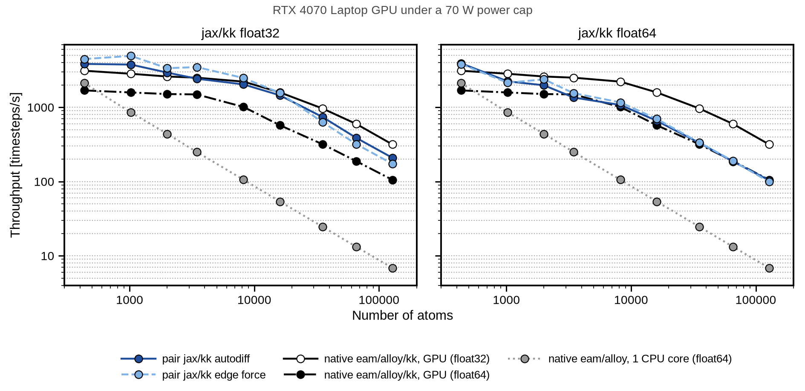

# Reference benchmark: `pair jax/kk` vs native Kokkos (EAM)

The target to match when Stage 1's ACE export is verified correct.

**Setup:** EAM (CuZr), RTX 4070 Laptop GPU under a 70 W power cap, throughput in
timesteps/s against atom count, both axes log. Measured by the maintainer, not by
us. Two `pair jax/kk` force paths are shown — autodiff and edge-force — against
native `eam/alloy/kk` on GPU in f32 and f64, plus a single-core CPU baseline.

## What it shows

**f32 (left).** Both `jax/kk` paths start *above* native f32 — roughly 4000–5000
vs ~3000 timesteps/s below ~1000 atoms — and stay competitive to around 8k atoms.
Beyond that native f32 pulls ahead, reaching ~320 vs ~200 at ~128k atoms. Both
`jax/kk` f32 paths beat native **f64** GPU across the whole range.

**f64 (right).** `jax/kk` tracks native f64 Kokkos closely for most of the range
and converges with it at large N (~100 vs ~105 at 128k atoms). Native f32 remains
the fastest line throughout, as expected.

**The CPU baseline** falls away steeply — ~1700 timesteps/s at 500 atoms to ~7 at
128k — which is the case for a GPU path at all.

## Maintainer's note on the f32 dip

The mid-to-large-N shortfall in the f32 panel is **an artefact of neighbour-list
layout, not a property of the approach.** With the neighbours laid out properly it
is fixed, and `jax/kk` can match and in places beat Kokkos. Treat the f32 curves
here as a floor rather than a ceiling.

## What we should measure for ACE

Once Stage 1's ACE export is verified correct (Phase 6 gate: a Si bundle loading
under `pair_style jax/kk` and reproducing our Python calculator), run the
equivalent comparison:

- throughput vs atom count, same log-log shape, over a comparable range
- both force paths where applicable — autodiff is the ACE case, since energy
  exports get forces by autodiff and are `newton on` only
- f32 and f64 separately. **f64 matters more for ACE than it did here**: Phase 0
  measured f64 at only 3–5.4x f32 on a 1/64-rate card because the descriptor is
  memory-bound, so the usual reason to accept f32 is weaker.
- pay attention to neighbour-list layout from the start, given the note above

There is no native Kokkos ACE pair style to compare against directly, so the
reference line should be `pair_style pace` (ML-PACE) or the Julia
`ACEpotentials` calculator, whichever is the fairer comparison — worth deciding
before measuring rather than after.

**Do not benchmark before the correctness gate passes.** Phase 0 established that
timing a path that has not been validated produces numbers nobody can act on.
